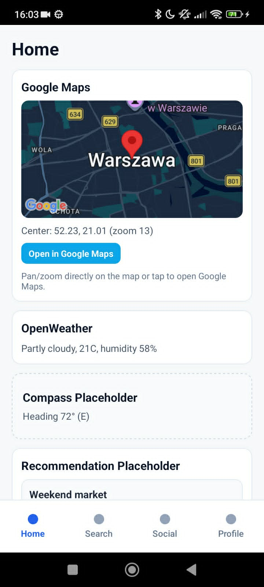
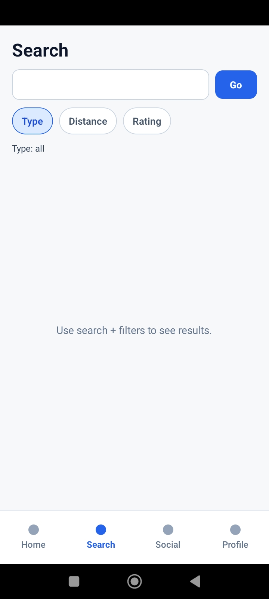
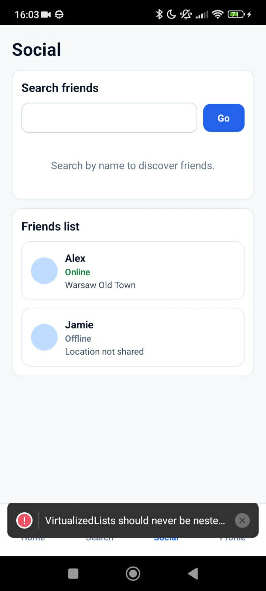
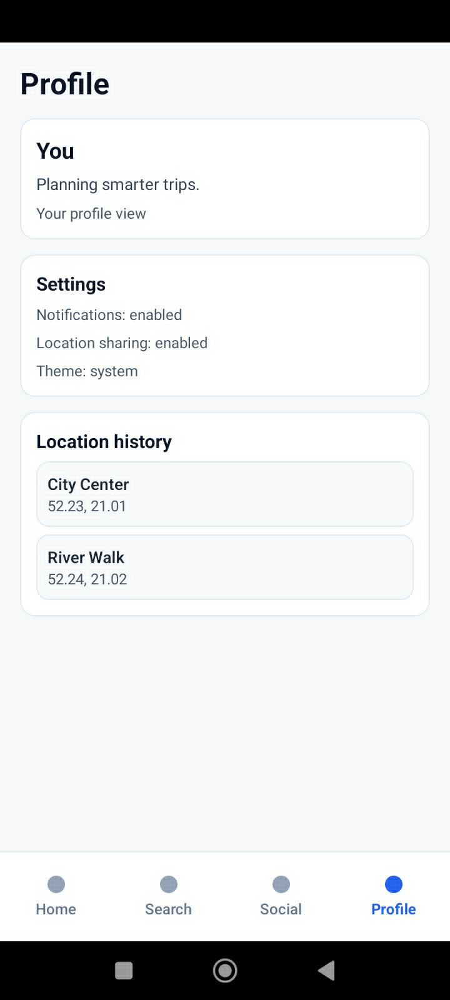

# Prezentacja aplikacji 

Zaimplementowano cztery główne widoki. Pełna logika jest na razie ograniczona — **na razie działają** integracje **Google Maps** (podgląd mapy, współrzędne, otwarcie w aplikacji Maps) oraz **OpenWeather** (aktualna pogoda). Pozostałe moduły (kompas, rekomendacje, wyszukiwanie, social) mają głównie **layout i placeholdery** albo dane demonstracyjne; część z nich jest podpięta pod hooki/API w przygotowaniu pod dalszy rozwój.

---

## Film — przegląd całości
<video src="3ca580db-f3b3-495a-966f-c187da3d3a40.mp4" controls width="100%" style="max-width: 420px;"></video>

---

## 1. Widok Home

**Rola ekranu:** pulpit startowy — zgrupowane „karty” z informacjami kontekstowymi (lokalizacja, pogoda, miejsce na sensory i rekomendacje).

- **Google Maps** — interaktywny fragment mapy (np. okolice Warszawy), pinezka, opis środka i poziomu zoomu, przycisk **Open in Google Maps** oraz krótka podpowiedź o pan/zoom i otwarciu w zewnętrznej aplikacji.
- **OpenWeather** — bieżąca pogoda (np. opis nieba, temperatura, wilgotność) dla współrzędnych domyślnych z konfiguracji ekranu.
- **Compass Placeholder** — karta z obramowaniem „placeholder”; pokazuje kierunek w stopniach i skrót kardynalny, ale **nie jest to jeszcze docelowa, dopracowana logika kompasu** w sensie produktu.
- **Recommendation Placeholder** — sekcja na listę propozycji (np. przykładowe wpisy typu wydarzenie w weekend); **dane mogą pochodzić z hooka**, ale prezentacja jest listą demonstracyjną
---

## 2. Widok Search

**Rola ekranu:** wyszukiwanie miejsc / wydarzeń z filtrowaniem.

- **filtry** Type, Distance, Rating — przełączanie aktywnego filtra i zmiana wartości (np. typ: all / places / events, dystans w km, minimalna ocena).
- **Stan początkowy:** komunikat zachęcający do użycia wyszukiwania i filtrów zamiast listy wyników — logika wyników jest **szkieletem** pod dalsze podłączenie backendu.

---

## 3. Widok Social

**Rola ekranu:** warstwa „społecznościowa” — odnajdywanie znajomych i podgląd listy kontaktów.

- Karta **Search friends** — pole wyszukiwania po nazwie.
- Karta **Friends list** — przykładowe wpisy (np. status online/offline, lokalizacja lub jej brak).

---

## 4. Widok Profile

**Rola ekranu:** tożsamość użytkownika w aplikacji, ustawienia i skrót historii miejsc.

- Sekcja **You** — krótki opis profilu / hasło marketingowe i podpis „Your profile view”.
- **Settings** — przykładowe przełączniki informacyjne (powiadomienia, udostępnianie lokalizacji, motyw: system).
- **Location history** — lista punktów z nazwą i współrzędnymi (dane demonstracyjne).

---

